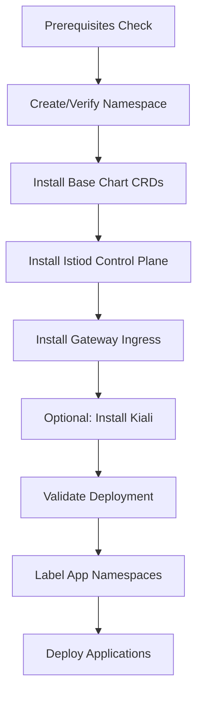

# Istio Deployment Examples

This directory contains example deployment scripts and configurations for deploying Istio service mesh on Azure Kubernetes Service (AKS).

## Overview

Istio charts support **progressive security** across multiple environments:
- **Development**: Fast iteration, minimal resources, PERMISSIVE mTLS
- **Staging**: Pre-production testing, STRICT mTLS, moderate HA
- **Production**: FIPS compliance, full security, high availability

## Quick Start

### Development Deployment

For local development and testing:

```bash
# Deploy with minimal resources and PERMISSIVE mTLS
./examples/deploy-istio-dev.sh --with-kiali

# Validate deployment
./examples/validate-istio-deployment.sh --environment dev
```

**Characteristics**:
- 1 replica per component
- PERMISSIVE mTLS (allows plaintext + mTLS)
- No FIPS requirement
- Minimal resources (250m CPU, 512Mi memory)
- Anonymous Kiali authentication

### Staging Deployment

For pre-production validation:

```bash
# Deploy with moderate HA and STRICT mTLS
./examples/deploy-istio-staging.sh --namespace istio-staging --with-kiali

# Validate deployment
./examples/validate-istio-deployment.sh --namespace istio-staging --environment staging
```

**Characteristics**:
- 2 replicas per component
- HPA: 2-4 replicas
- STRICT mTLS (enforced mutual TLS)
- No FIPS (cost optimization for pre-prod)
- Moderate security baseline
- Token-based Kiali auth

### Production Deployment

For production workloads with FIPS compliance:

```bash
# Prerequisites: Create FIPS node pool
az aks nodepool add \
  --resource-group my-rg \
  --cluster-name my-aks \
  --name fipspool \
  --node-count 3 \
  --enable-fips-image \
  --labels fips=enabled

# Dry-run first (recommended)
./examples/deploy-istio-production.sh --dry-run

# Deploy with full security and HA
./examples/deploy-istio-production.sh --with-kiali

# Comprehensive validation
./examples/validate-istio-deployment.sh --environment production
```

**Characteristics**:
- 3 replicas per component
- HPA: 3-5 replicas
- STRICT mTLS + FIPS 140-2 compliance
- Full security baseline (PeerAuthentication, AuthorizationPolicy, NetworkPolicy)
- Pod anti-affinity across AZs
- Production resources (500m-1000m CPU, 1-2Gi memory)
- Token or OpenID Kiali auth

---

## Available Scripts

### Deployment Scripts

| Script | Environment | Purpose | FIPS | Replicas | mTLS |
|--------|-------------|---------|------|----------|------|
| `deploy-istio-dev.sh` | Development | Local testing | ❌ No | 1 | PERMISSIVE |
| `deploy-istio-staging.sh` | Staging | Pre-prod testing | ❌ No | 2 (HPA 2-4) | STRICT |
| `deploy-istio-production.sh` | Production | Live traffic | ✅ Yes | 3 (HPA 3-5) | STRICT |

#### Script Options

All deployment scripts support the following options:

```bash
--namespace NAMESPACE    # Target namespace (default varies by environment)
--with-kiali            # Include Kiali dashboard (optional)
--help                  # Show help message
```

Production script additional options:
```bash
--dry-run               # Test deployment without applying changes
```

### Operational Scripts

| Script | Purpose | Use Case |
|--------|---------|----------|
| `upgrade-istio.sh` | Upgrade Istio versions | Minor/patch version upgrades |
| `validate-istio-deployment.sh` | Deployment validation | Health checks, security verification |

#### Upgrade Script

Automates sequential upgrade of all Istio components:

```bash
# Upgrade to new version
./examples/upgrade-istio.sh --version 1.23.1 --environment production

# Dry-run first
./examples/upgrade-istio.sh --version 1.23.1 --environment production --dry-run

# Skip specific components
./examples/upgrade-istio.sh --version 1.23.1 --skip-gateway
```

**Features**:
- Sequential upgrade (base → istiod → gateway)
- Automatic state backup
- Health verification before/after
- Post-upgrade validation
- Comprehensive error handling

**Options**:
- `--version`: Target Istio version (required)
- `--environment`: Environment values file (dev, staging, production)
- `--namespace`: Target namespace (default: istio-system)
- `--dry-run`: Test upgrade without applying
- `--skip-base`: Skip base chart upgrade
- `--skip-istiod`: Skip istiod upgrade
- `--skip-gateway`: Skip gateway upgrade
- `--timeout`: Helm operation timeout (default: 5m)

#### Validation Script

Comprehensive deployment validation:

```bash
# Basic validation
./examples/validate-istio-deployment.sh

# Environment-specific validation
./examples/validate-istio-deployment.sh --environment production

# Custom namespace
./examples/validate-istio-deployment.sh --namespace istio-staging --environment staging
```

**Validation Checks**:
1. ✅ Helm releases (base, istiod, gateway, kiali)
2. ✅ Istio CRDs (25+ required CRDs)
3. ✅ Component health (pod readiness, replica counts)
4. ✅ Services (istiod, gateway, LoadBalancer IP)
5. ✅ Configuration (mTLS mode, security policies)
6. ✅ FIPS compliance (production: distroless images, GOFIPS=1)
7. ✅ Extended checks with istioctl (proxy status, config analysis)
8. ✅ HPA configuration (staging/production)

**Options**:
- `--namespace`: Target namespace (default: istio-system)
- `--environment`: Expected environment for validation (dev, staging, production)

---

## Environment Comparison

| Feature | Development | Staging | Production |
|---------|-------------|---------|------------|
| **Replicas** | 1 | 2 (HPA 2-4) | 3 (HPA 3-5) |
| **mTLS Mode** | PERMISSIVE | STRICT | STRICT |
| **FIPS** | ❌ Disabled | ❌ Disabled | ✅ Enabled |
| **Resources** | 250m CPU, 512Mi RAM | 500m CPU, 1Gi RAM | 500m-1000m CPU, 1-2Gi RAM |
| **Security** | Minimal | Moderate | Full baseline |
| **Anti-Affinity** | None | Preferred | Required |
| **Kiali Auth** | Anonymous | Token | Token/OpenID |
| **Cost** | ~$30-50/mo | ~$100-150/mo | ~$200-300/mo |
| **Use Case** | Local dev, testing | Pre-prod validation | Live production traffic |

---

## Prerequisites

### Common Requirements

All environments require:
- **AKS cluster** (Kubernetes 1.26+)
- **Helm** 3.10 or higher
- **kubectl** configured with cluster access
- **Target namespace** created (or use `--create-namespace`)

### Production Additional Requirements

Production deployments additionally require:
- **FIPS-enabled node pool** with label `fips=enabled`
- **3+ availability zones** for high availability
- **Network plugin**: Azure CNI (for NetworkPolicy support)
- **Resource quotas**: Sufficient for 3-5 replicas per component
- **Monitoring**: Prometheus/Grafana or Azure Monitor
- **Certificate management**: cert-manager or Azure Key Vault

### Create FIPS Node Pool

```bash
az aks nodepool add \
  --resource-group <resource-group> \
  --cluster-name <cluster-name> \
  --name fipspool \
  --node-count 3 \
  --node-vm-size Standard_D4s_v3 \
  --enable-fips-image \
  --labels fips=enabled \
  --zones 1 2 3
```

---

## Deployment Workflow

### Standard Deployment Flow



### Step-by-Step

**1. Prerequisites**
```bash
# Verify Helm and kubectl
helm version
kubectl cluster-info

# For production: verify FIPS node pool
kubectl get nodes -l fips=enabled
```

**2. Choose Environment**
```bash
# Development
./examples/deploy-istio-dev.sh --with-kiali

# Staging
./examples/deploy-istio-staging.sh --namespace istio-staging --with-kiali

# Production (with dry-run first)
./examples/deploy-istio-production.sh --dry-run
./examples/deploy-istio-production.sh --with-kiali
```

**3. Validate Deployment**
```bash
./examples/validate-istio-deployment.sh --environment <env>
```

**4. Configure Applications**
```bash
# Label namespace for automatic sidecar injection
kubectl label namespace <app-namespace> istio-injection=enabled

# Deploy application
kubectl apply -f <app-manifests>

# Verify sidecar injection
kubectl get pods -n <app-namespace>
# Each pod should show 2/2 containers (app + envoy sidecar)
```

**5. Configure Ingress**
```bash
# Create Gateway resource
kubectl apply -f - <<EOF
apiVersion: networking.istio.io/v1beta1
kind: Gateway
metadata:
  name: my-gateway
  namespace: istio-system
spec:
  selector:
    istio: ingressgateway
  servers:
  - port:
      number: 80
      name: http
      protocol: HTTP
    hosts:
    - "*"
EOF

# Create VirtualService
kubectl apply -f - <<EOF
apiVersion: networking.istio.io/v1beta1
kind: VirtualService
metadata:
  name: my-app
  namespace: <app-namespace>
spec:
  hosts:
  - "*"
  gateways:
  - istio-system/my-gateway
  http:
  - route:
    - destination:
        host: my-app-service
        port:
          number: 80
EOF
```

---

## Troubleshooting

### Common Issues

#### 1. Pods Not Starting

**Symptom**: Pods stuck in `Pending` or `CrashLoopBackOff`

**Diagnosis**:
```bash
kubectl describe pods -n istio-system -l app=istiod
kubectl logs -n istio-system -l app=istiod
```

**Solutions**:
- Check resource quotas: `kubectl describe resourcequota -n istio-system`
- Verify node capacity: `kubectl describe nodes`
- For FIPS: Ensure pods scheduled on FIPS nodes

#### 2. Gateway LoadBalancer Pending

**Symptom**: Gateway service shows `EXTERNAL-IP: <pending>`

**Diagnosis**:
```bash
kubectl get svc istio-ingressgateway -n istio-system
kubectl describe svc istio-ingressgateway -n istio-system
```

**Solutions**:
- Wait 2-5 minutes for Azure to provision LoadBalancer
- Check AKS service limits
- Verify no conflicting network policies

#### 3. Sidecar Not Injected

**Symptom**: Application pods show 1/1 containers (no sidecar)

**Diagnosis**:
```bash
kubectl get namespace <app-namespace> --show-labels
kubectl get mutatingwebhookconfiguration istio-sidecar-injector -o yaml
```

**Solutions**:
- Label namespace: `kubectl label namespace <app-namespace> istio-injection=enabled`
- Restart pods: `kubectl rollout restart deployment/<app> -n <app-namespace>`
- Verify webhook: `kubectl get mutatingwebhookconfiguration`

#### 4. mTLS Connection Failures

**Symptom**: `upstream connect error or disconnect/reset before headers`

**Diagnosis**:
```bash
kubectl get peerauthentication -n istio-system
istioctl analyze --namespace <app-namespace>
```

**Solutions**:
- For dev: Use PERMISSIVE mode to allow plaintext
- Verify both sides have sidecars injected
- Check AuthorizationPolicy rules
- Review PeerAuthentication configuration

#### 5. FIPS Validation Failure

**Symptom**: Pods not using distroless images or GOFIPS not set

**Diagnosis**:
```bash
kubectl get pods -n istio-system -l app=istiod \
  -o jsonpath='{.items[0].spec.containers[0].image}'

kubectl get pods -n istio-system -l app=istiod \
  -o jsonpath='{.items[0].spec.containers[0].env[?(@.name=="GOFIPS")].value}'
```

**Solutions**:
- Verify using `values-prod.yaml` with `global.fips.enabled: true`
- Check image tag contains `-distroless`
- Ensure pods scheduled on FIPS node pool

---

## Additional Resources

### Documentation

- **Deployment Guide**: [docs/istio-aks-deployment.md](../docs/istio-aks-deployment.md)
- **Base Chart**: [charts/istio/base/README.md](../charts/istio/base/README.md)
- **Istiod Chart**: [charts/istio/istiod/README.md](../charts/istio/istiod/README.md)
- **Gateway Chart**: [charts/istio/gateway/README.md](../charts/istio/gateway/README.md)
- **Kiali Chart**: [charts/istio/kiali/README.md](../charts/istio/kiali/README.md)

### Example Values Files

Each chart includes environment-specific values:
- `values-dev.yaml`: Development configuration
- `values-staging.yaml`: Staging configuration
- `values-prod.yaml`: Production configuration with FIPS

Location: `charts/istio/{base,istiod,gateway,kiali}/values-*.yaml`

### Support

For issues or questions:
1. Check the comprehensive deployment guide: `docs/istio-aks-deployment.md`
2. Review chart-specific README files
3. Run validation script: `./examples/validate-istio-deployment.sh`
4. Check Istio documentation: https://istio.io/latest/docs/

---

## Migration Path

### From Development to Production

**Phase 1: Development** → **Phase 2: Staging** → **Phase 3: Production**

1. **Dev to Staging**:
   ```bash
   # Test with STRICT mTLS in staging
   ./examples/deploy-istio-staging.sh --namespace istio-staging
   ./examples/validate-istio-deployment.sh --namespace istio-staging --environment staging
   ```

2. **Staging to Production**:
   ```bash
   # Create FIPS node pool
   az aks nodepool add ... --enable-fips-image
   
   # Deploy with FIPS and full security
   ./examples/deploy-istio-production.sh
   ./examples/validate-istio-deployment.sh --environment production
   ```

### Upgrading Istio Versions

```bash
# Test in dev first
./examples/upgrade-istio.sh --version 1.23.1 --environment dev --namespace istio-dev

# Then staging
./examples/upgrade-istio.sh --version 1.23.1 --environment staging --namespace istio-staging

# Finally production (with backup)
./examples/upgrade-istio.sh --version 1.23.1 --environment production
```

For canary upgrades (zero-downtime), see:
- [Canary Upgrade Guide](../charts/istio/istiod/README.md#canary-upgrades)
- [Comprehensive Upgrade Guide](../docs/istio-aks-deployment.md#upgrade-procedures)

---

## Security Considerations

### Development

- ⚠️ PERMISSIVE mTLS allows plaintext traffic (not production-ready)
- ⚠️ Anonymous Kiali access (no authentication)
- ⚠️ Minimal security policies
- ✅ Suitable for local development only

### Staging

- ✅ STRICT mTLS enforced
- ✅ Token-based Kiali authentication
- ✅ Moderate security baseline
- ⚠️ No FIPS compliance (cost optimization)

### Production

- ✅ STRICT mTLS enforced
- ✅ FIPS 140-2 compliance (BoringSSL/Certificate #4407)
- ✅ Full security baseline (PeerAuthentication, AuthorizationPolicy, NetworkPolicy)
- ✅ Token or OpenID Kiali authentication
- ✅ Pod anti-affinity for resilience
- ✅ HPA for automatic scaling
- ✅ Production resource limits

---

## Cost Optimization

| Environment | Monthly Cost (est.) | Optimization Tips |
|-------------|---------------------|-------------------|
| **Dev** | $30-50 | Use single replicas, standard nodes |
| **Staging** | $100-150 | Skip FIPS, use fewer replicas |
| **Production** | $200-300 | Right-size HPA thresholds, use reserved instances |

**Cost Reduction Strategies**:
1. Use spot nodes for dev/staging (not production)
2. Configure aggressive HPA scale-down policies
3. Use node auto-scaling
4. Optimize resource requests/limits
5. Skip Kiali in air-gapped environments

---

## Feedback and Contributions

For feedback, issues, or contributions, please refer to the main repository documentation.
